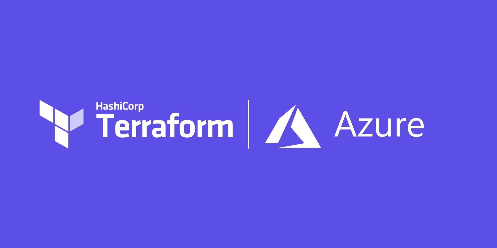
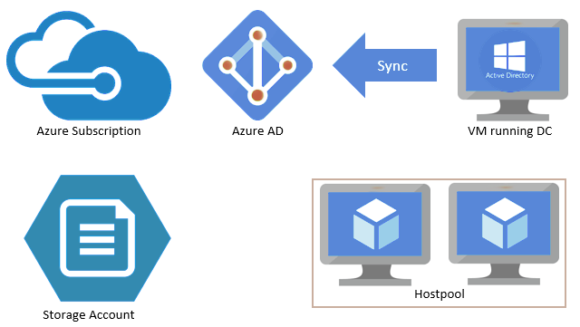

# azure-terraform-avd

# <font color = "blue"> What is Azure Virtual Desktop? </font>
Azure Virtual Desktop is an instanced virtual machine hosting a desktop and app virtualization service running on the cloud. Azure Virtual Desktop delivers a virtual desktop experience and remote apps to any device.




# <font color = "green"> What are the benefits of using Az Virtual Desktop? </font>
- Enable secure and productive remote work on any device
- Reduce costs of licensing and infrastructure
- Protect against outages to stay productive
- Simplify IT management
- Keep application and user data secure

## <font color = "green"> Why is Azure Virtual Desktop important? </font>
- Modern workload is increasingly becoming a remote and mobile workforce.
- To have stressless access to your company environment and with high standard of security.


[ To learn more about Azure virtual desktop, click here](https://docs.microsoft.com/en-us/azure/virtual-desktop/overview)


### <font color = "green"> Overview and requirements </font>
The steps listed below must be completed in order to deploy a Virtual Desktop host pool with Terraform.

- Ensure that you meet the requirements for Windows Virtual Desktop.
> - DC/AAD DS
> - WVD tenant must be created
> - TenantCreator role must be assigned
> - VNET configured with Layer 3 access to DC/AAD DS
- Terraform must be installed and configured as outlined [here](hehttps://docs.microsoft.com/en-us/azure/developer/terraform/get-started-cloud-shell-bash?tabs=bashre)
- Terraform code from [GitHub repository](https://github.com/devopshubproject/azure-terraform-avd) is downloaded to a local folder.
- Terraform files variables.tf and tfvars files are update.
- Terraform deployment is started.
```
> - terraform init
> - terraform plan
> - terraform apply
```
- Validate session host VMs are deployed and heart beating via Get-RdsSessionHost.
- To destory terraform deployment
```
> - terraform destroy
```

<font color = "yellow"> | Sample architecture flow: </font>




## <font color = "red"> Follow-Me </font>

[](https://github.com/premkumar-palanichamy)

<p align="left">
<a href="https://linkedin.com/in/premkumarpalanichamy" target="blank"></a>
</p>

[](https://www.youtube.com/channel/UCJKEn6HeAxRNirDMBwFfi3w)